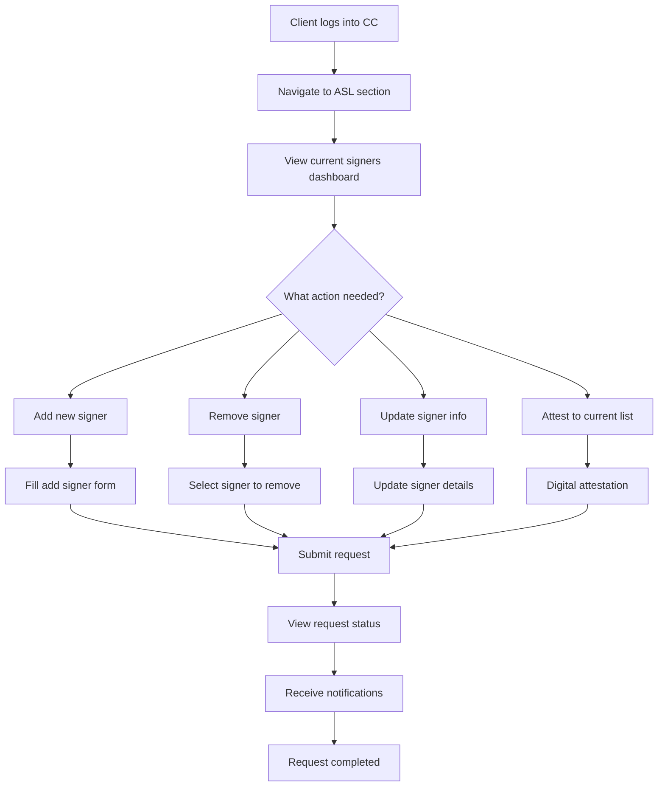
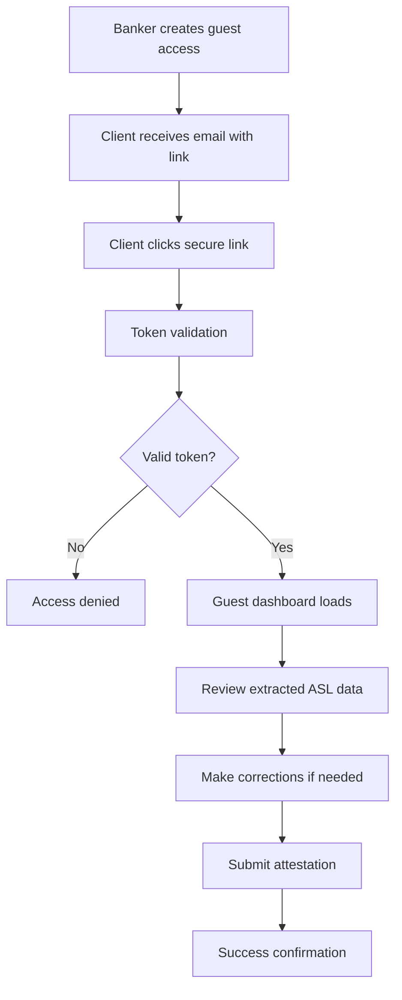
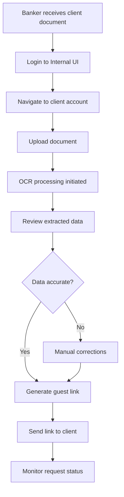
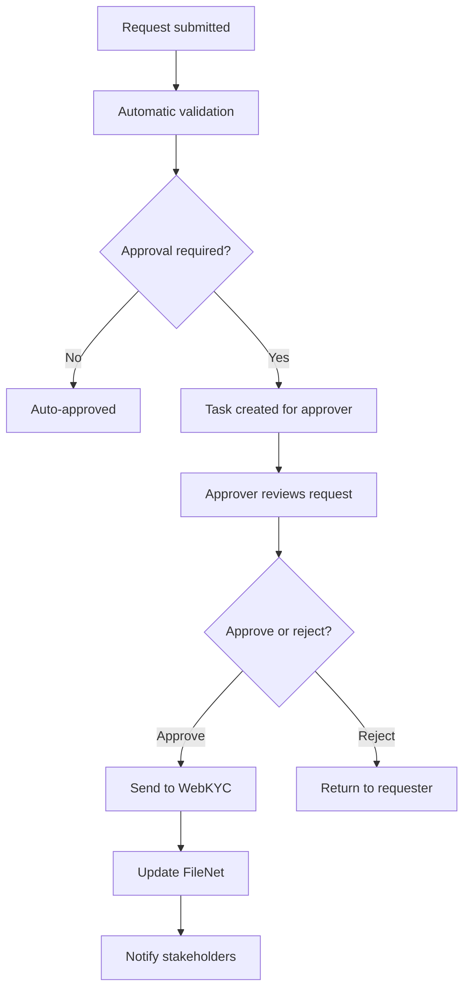
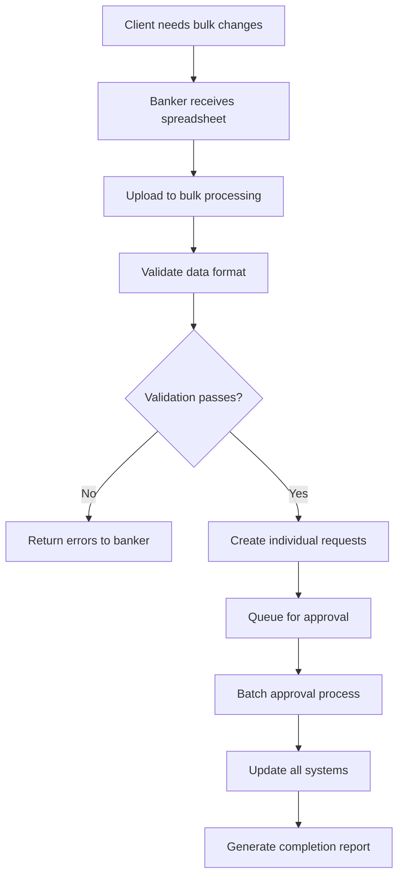

# Auth Signer System - Comprehensive Developer Architecture

## 1. System Overview

### 1.1 Mission Statement

Build a centralized, automated, and auditable system for managing authorized signers that serves as the single source of truth for all business lines, starting with CME (Client Manager Enterprise) and expanding to IT&C and others.

### 1.2 Key Metrics

- **Current Volume**: 500+ changes per month (CME only)
- **Target Timeline**: MVP by Q4 2025
- **Business Lines**: CME (MVP), IT&C (Phase 2), GSF/GCT (Future)
- **Historical Data**: 7+ years of legacy documents to digitize

## 2. High-Level Architecture

### 2.1 Core Components

```
┌─────────────────────────────────────────────────────────────────┐
│                    External Integrations                        │
├─────────────────────────────────────────────────────────────────┤
│  OCR Service  │  WebKYC  │  FileNet  │  Service Request Platform │
└─────────────────────────────────────────────────────────────────┘
                                 │
┌─────────────────────────────────────────────────────────────────┐
│                      API Gateway Layer                          │
└─────────────────────────────────────────────────────────────────┘
                                 │
┌─────────────────────────────────────────────────────────────────┐
│                 Auth Signer Service (Spring Boot)               │
├─────────────────────────────────────────────────────────────────┤
│  Business Logic  │  Validation Engine  │  Workflow Orchestrator │
└─────────────────────────────────────────────────────────────────┘
                                 │
┌─────────────────────────────────────────────────────────────────┐
│              Auth Signer Repository (SQL Server)                │
└─────────────────────────────────────────────────────────────────┘
                                 │
┌─────────────────────────────────────────────────────────────────┐
│                        User Interfaces                          │
├─────────────────────────────────────────────────────────────────┤
│    Internal UI (React)    │    External UI (React/CC Portal)    │
└─────────────────────────────────────────────────────────────────┘
```

## 3. Detailed Component Architecture

### 3.1 Auth Signer Service (Backend)

**Technology Stack**: Spring Boot 3.x, Java 17+, Maven

#### 3.1.1 Service Layers

```java
// Core Service Structure
com.usbank.authsigner/
├── controller/          // REST API endpoints
├── service/            // Business logic layer
├── repository/         // Data access layer
├── model/             // Domain entities
├── dto/               // Data transfer objects
├── config/            // Configuration classes
├── security/          // Authentication & authorization
├── integration/       // External service clients
└── validation/        // Business rule validators
```

#### 3.1.2 Key Service Components

**AuthSignerService**: Core business logic

- CRUD operations for ASL management
- Validation rule enforcement
- Workflow orchestration
- Audit trail management

**ValidationEngine**: Business rule processor

- Single-signer validation
- Multi-person approval workflows
- Business line specific rules
- Compliance checks

**IntegrationOrchestrator**: External service coordinator

- WebKYC updates
- FileNet document management
- OCR service communication
- Notification services

#### 3.1.3 API Endpoints

```yaml
# Core ASL Management
GET    /api/v1/accounts/{accountId}/authorized-signers
POST   /api/v1/accounts/{accountId}/authorized-signers
PUT    /api/v1/accounts/{accountId}/authorized-signers/{signerId}
DELETE /api/v1/accounts/{accountId}/authorized-signers/{signerId}

# Request Management
POST   /api/v1/requests
GET    /api/v1/requests/{requestId}
PUT    /api/v1/requests/{requestId}/status
GET    /api/v1/requests/pending

# Bulk Operations
POST   /api/v1/bulk/upload
GET    /api/v1/bulk/status/{jobId}

# Guest User Operations
POST   /api/v1/guest/provision
GET    /api/v1/guest/verify/{token}

# Integration Endpoints
POST   /api/v1/ocr/process
POST   /api/v1/onboarding/import
```

### 3.2 Auth Signer Repository (Database)

**Technology**: SQL Server 2019+

#### 3.2.1 Database Schema

```sql
-- Core Tables

-- Accounts table (links to existing bank account system)
CREATE TABLE accounts (
    account_id VARCHAR(50) PRIMARY KEY,
    business_line VARCHAR(20) NOT NULL, -- CME, ITC, GSF, GCT
    account_name VARCHAR(255) NOT NULL,
    client_id VARCHAR(50) NOT NULL,
    created_date DATETIME2 DEFAULT GETDATE(),
    updated_date DATETIME2 DEFAULT GETDATE(),
    status VARCHAR(20) DEFAULT 'ACTIVE'
);

-- Authorized signers master table
CREATE TABLE authorized_signers (
    signer_id UNIQUEIDENTIFIER PRIMARY KEY DEFAULT NEWID(),
    account_id VARCHAR(50) NOT NULL,
    first_name VARCHAR(100) NOT NULL,
    last_name VARCHAR(100) NOT NULL,
    middle_name VARCHAR(100),
    email VARCHAR(255),
    phone VARCHAR(20),
    title VARCHAR(100),
    privilege_level VARCHAR(50) NOT NULL, -- SINGLE, DUAL, VIEW_ONLY
    authorization_limit DECIMAL(15,2),
    effective_date DATE NOT NULL,
    expiration_date DATE,
    status VARCHAR(20) DEFAULT 'ACTIVE', -- ACTIVE, INACTIVE, PENDING
    created_date DATETIME2 DEFAULT GETDATE(),
    updated_date DATETIME2 DEFAULT GETDATE(),
    FOREIGN KEY (account_id) REFERENCES accounts(account_id)
);

-- Request management table
CREATE TABLE asl_requests (
    request_id UNIQUEIDENTIFIER PRIMARY KEY DEFAULT NEWID(),
    account_id VARCHAR(50) NOT NULL,
    request_type VARCHAR(20) NOT NULL, -- ADD, REMOVE, UPDATE, ATTEST
    initiated_by VARCHAR(100) NOT NULL,
    initiated_date DATETIME2 DEFAULT GETDATE(),
    status VARCHAR(20) DEFAULT 'DRAFT', -- DRAFT, PENDING, APPROVED, REJECTED
    approval_required BOOLEAN DEFAULT FALSE,
    completed_date DATETIME2,
    business_justification TEXT,
    FOREIGN KEY (account_id) REFERENCES accounts(account_id)
);

-- Request details for each signer change
CREATE TABLE asl_request_details (
    detail_id UNIQUEIDENTIFIER PRIMARY KEY DEFAULT NEWID(),
    request_id UNIQUEIDENTIFIER NOT NULL,
    signer_id UNIQUEIDENTIFIER,
    action VARCHAR(10) NOT NULL, -- ADD, REMOVE, UPDATE
    before_data NVARCHAR(MAX), -- JSON of previous state
    after_data NVARCHAR(MAX),  -- JSON of new state
    FOREIGN KEY (request_id) REFERENCES asl_requests(request_id),
    FOREIGN KEY (signer_id) REFERENCES authorized_signers(signer_id)
);

-- Approval workflow table
CREATE TABLE asl_approvals (
    approval_id UNIQUEIDENTIFIER PRIMARY KEY DEFAULT NEWID(),
    request_id UNIQUEIDENTIFIER NOT NULL,
    approver_id VARCHAR(100) NOT NULL,
    approval_level INT NOT NULL, -- 1, 2, 3 for multi-level approvals
    status VARCHAR(20) DEFAULT 'PENDING', -- PENDING, APPROVED, REJECTED
    comments TEXT,
    approved_date DATETIME2,
    FOREIGN KEY (request_id) REFERENCES asl_requests(request_id)
);

-- Audit trail table (immutable)
CREATE TABLE asl_audit_log (
    log_id UNIQUEIDENTIFIER PRIMARY KEY DEFAULT NEWID(),
    account_id VARCHAR(50) NOT NULL,
    signer_id UNIQUEIDENTIFIER,
    action VARCHAR(50) NOT NULL,
    changed_by VARCHAR(100) NOT NULL,
    change_timestamp DATETIME2 DEFAULT GETDATE(),
    before_state NVARCHAR(MAX), -- JSON snapshot
    after_state NVARCHAR(MAX),  -- JSON snapshot
    source_system VARCHAR(50),  -- INTERNAL_UI, EXTERNAL_UI, OCR, ONBOARDING
    ip_address VARCHAR(45),
    session_id VARCHAR(100)
);

-- Guest user access tokens
CREATE TABLE guest_tokens (
    token_id UNIQUEIDENTIFIER PRIMARY KEY DEFAULT NEWID(),
    account_id VARCHAR(50) NOT NULL,
    email VARCHAR(255) NOT NULL,
    token_hash VARCHAR(255) NOT NULL,
    expires_at DATETIME2 NOT NULL,
    used_at DATETIME2,
    created_date DATETIME2 DEFAULT GETDATE()
);

-- Business line configurations
CREATE TABLE business_line_configs (
    config_id UNIQUEIDENTIFIER PRIMARY KEY DEFAULT NEWID(),
    business_line VARCHAR(20) NOT NULL,
    config_key VARCHAR(100) NOT NULL,
    config_value NVARCHAR(MAX),
    effective_date DATETIME2 DEFAULT GETDATE(),
    UNIQUE(business_line, config_key)
);

-- Document attachments
CREATE TABLE asl_documents (
    document_id UNIQUEIDENTIFIER PRIMARY KEY DEFAULT NEWID(),
    request_id UNIQUEIDENTIFIER NOT NULL,
    document_name VARCHAR(255) NOT NULL,
    document_type VARCHAR(50), -- PDF, IMAGE, SIGNED_PDF
    file_path VARCHAR(500),
    filenet_id VARCHAR(100),
    ocr_processed BOOLEAN DEFAULT FALSE,
    ocr_confidence_score DECIMAL(3,2),
    uploaded_date DATETIME2 DEFAULT GETDATE(),
    FOREIGN KEY (request_id) REFERENCES asl_requests(request_id)
);
```

#### 3.2.2 Indexes and Performance

```sql
-- Performance indexes
CREATE INDEX IX_accounts_business_line ON accounts(business_line);
CREATE INDEX IX_authorized_signers_account_status ON authorized_signers(account_id, status);
CREATE INDEX IX_asl_requests_status_date ON asl_requests(status, initiated_date);
CREATE INDEX IX_audit_log_account_timestamp ON asl_audit_log(account_id, change_timestamp);
CREATE INDEX IX_guest_tokens_expires ON guest_tokens(expires_at) WHERE used_at IS NULL;
```

### 3.3 Frontend Applications

#### 3.3.1 External UI (Client Portal)

**Technology**: React 18+, TypeScript, Material-UI

**Integration**: Embedded within Corporate Connect portal

**Core Components**:

```typescript
// Component Structure
src/
├── components/
│   ├── dashboard/
│   │   ├── ASLDashboard.tsx
│   │   ├── SignerList.tsx
│   │   └── RequestStatus.tsx
│   ├── forms/
│   │   ├── AddSignerForm.tsx
│   │   ├── RemoveSignerForm.tsx
│   │   ├── UpdateSignerForm.tsx
│   │   └── AttestationForm.tsx
│   ├── common/
│   │   ├── DataTable.tsx
│   │   ├── StatusBadge.tsx
│   │   └── LoadingSpinner.tsx
│   └── guest/
│       ├── GuestLogin.tsx
│       └── GuestDashboard.tsx
├── services/
│   ├── authSignerApi.ts
│   ├── guestTokenService.ts
│   └── documentService.ts
├── hooks/
│   ├── useASLData.ts
│   ├── useRequestStatus.ts
│   └── useGuestSession.ts
└── utils/
    ├── validation.ts
    ├── formatters.ts
    └── constants.ts
```

#### 3.3.2 Internal UI (Banker Portal)

**Technology**: React 18+, TypeScript, Ant Design

**Core Components**:

```typescript
// Component Structure for Internal UI
src/
├── components/
│   ├── dashboard/
│   │   ├── BankerDashboard.tsx
│   │   ├── TaskQueue.tsx
│   │   └── ClientSearch.tsx
│   ├── requests/
│   │   ├── RequestReview.tsx
│   │   ├── ApprovalWorkflow.tsx
│   │   └── BulkUpload.tsx
│   ├── ocr/
│   │   ├── DocumentUpload.tsx
│   │   ├── OCRReview.tsx
│   │   └── DataValidation.tsx
│   └── admin/
│       ├── SystemConfig.tsx
│       ├── UserManagement.tsx
│       └── AuditReports.tsx
└── services/
    ├── internalApi.ts
    ├── ocrService.ts
    └── bulkUploadService.ts
```

## 4. Integration Architecture

### 4.1 OCR Service Integration

**Purpose**: Digitize historical documents and process new paper submissions

**Flow**:

1. Banker uploads document via Internal UI
2. Document sent to OCR service with metadata
3. OCR service processes using ML models
4. Structured JSON returned with confidence scores
5. Banker reviews and validates extracted data

**API Contract**:

```json
{
  "processDocument": {
    "request": {
      "documentId": "uuid",
      "documentType": "ASL_FORM",
      "businessLine": "CME",
      "imageData": "base64_encoded_image"
    },
    "response": {
      "extractedData": {
        "signers": [
          {
            "firstName": "John",
            "lastName": "Doe",
            "privilegeLevel": "SINGLE",
            "confidenceScore": 0.95
          }
        ],
        "overallConfidence": 0.92
      }
    }
  }
}
```

### 4.2 WebKYC Integration

**Purpose**: Update official privilege management system

**Flow**:

1. Request approved in Auth Signer Service
2. Service calls WebKYC API with signer changes
3. WebKYC performs compliance checks
4. Confirmation returned to Auth Signer Service

**API Contract**:

```json
{
  "updateSignerPrivileges": {
    "request": {
      "accountId": "12345",
      "signerId": "uuid",
      "action": "ADD",
      "privilegeLevel": "SINGLE",
      "effectiveDate": "2025-01-01"
    },
    "response": {
      "status": "SUCCESS",
      "webKycId": "WK123456"
    }
  }
}
```

### 4.3 Guest User Provisioning

**Purpose**: Provide secure, temporary access for clients without CC accounts

**Flow**:

1. Banker initiates guest access request
2. System generates secure token with expiration
3. Email sent to client with unique URL
4. Client accesses system using token
5. Token validates and provides scoped access

**Security Considerations**:

- Tokens expire in 24 hours
- Single-use tokens for sensitive operations
- IP address validation
- Rate limiting on token generation

## 5. User Journey & Persona Flows

### 5.1 Client User Persona Journey

#### 5.1.1 Existing CC User Flow



#### 5.1.2 Guest User Flow



### 5.2 Internal Banker Persona Journey

#### 5.2.1 OCR Processing Flow



#### 5.2.2 Approval Workflow



### 5.3 Multi-Persona Complex Scenarios

#### 5.3.1 Bulk Upload Scenario



## 6. Security Architecture

### 6.1 Authentication & Authorization

**Internal Users**: Integration with bank's SSO system
**External Users**: Corporate Connect authentication
**Guest Users**: Token-based temporary access

**Authorization Levels**:

- **Client User**: Can view/modify own account ASL
- **Banker**: Can view/modify client accounts in their portfolio
- **Risk Officer**: Can approve high-risk changes
- **System Admin**: Full system access

### 6.2 Data Security

**Encryption**: All PII encrypted at rest (AES-256)
**Transit Security**: TLS 1.3 for all communications
**API Security**: OAuth 2.0 with JWT tokens
**Audit Logging**: All actions logged with user context

## 7. Deployment Architecture

### 7.1 Environment Strategy

**Development**: Local development with Docker containers
**Testing**: Dedicated QA environment with test data
**Staging**: Production-like environment for UAT
**Production**: High-availability setup with load balancing

### 7.2 Infrastructure Requirements

```yaml
# Production Infrastructure
Application Servers:
  - 3x Spring Boot instances (load balanced)
  - CPU: 4 cores, RAM: 8GB per instance

Database:
  - SQL Server 2019 (HA cluster)
  - Primary + 2 replicas
  - Storage: 500GB initial, auto-growth enabled

Load Balancer:
  - Application Gateway with SSL termination
  - Health check endpoints configured

Monitoring:
  - Application Insights integration
  - Custom dashboards for business metrics
```

## 8. Data Migration Strategy

### 8.1 Historical Data Migration

**Phase 1**: Cognizant AI Processing

- Process 7+ years of FileNet documents
- Extract structured data using OCR/AI
- Validate extracted data against known records

**Phase 2**: Data Quality Validation

- Business users review extracted data
- Reconcile discrepancies
- Flag incomplete records for manual review

**Phase 3**: System Population

- Bulk import validated data
- Create audit trail for migrated records
- Generate reports for business validation

### 8.2 Ongoing Data Synchronization

**WebKYC Sync**: Daily batch job to ensure consistency
**FileNet Integration**: Real-time document updates
**Audit Trail**: All changes tracked with source system

## 9. Testing Strategy

### 9.1 Unit Testing

- Service layer: 90%+ code coverage
- Repository layer: All CRUD operations tested
- Validation logic: All business rules covered

### 9.2 Integration Testing

- External service integrations mocked
- End-to-end API testing with Postman
- Database integration testing with test containers

### 9.3 User Acceptance Testing

- CME business users validate workflows
- Client users test self-service functionality
- Performance testing with projected volumes

## 10. Monitoring & Operations

### 10.1 Application Monitoring

- Response time metrics for all APIs
- Error rate tracking and alerting
- Custom business metrics (requests processed, approval rates)

### 10.2 Business Metrics Dashboard

- Daily/weekly/monthly request volumes
- Processing time analytics
- User adoption metrics
- Error analysis and trends

## 11. Risk Mitigation

### 11.1 Technical Risks

- **Integration Failures**: Circuit breaker patterns, fallback mechanisms
- **Data Corruption**: Immutable audit trail, point-in-time recovery
- **Performance Issues**: Caching strategy, database optimization

### 11.2 Business Risks

- **User Adoption**: Comprehensive training program, gradual rollout
- **Data Quality**: Multiple validation layers, business user review
- **Regulatory Compliance**: Legal team review, audit trail requirements

This architecture provides a comprehensive foundation for building the Auth Signer system while maintaining flexibility for future enhancements and business line expansion.
